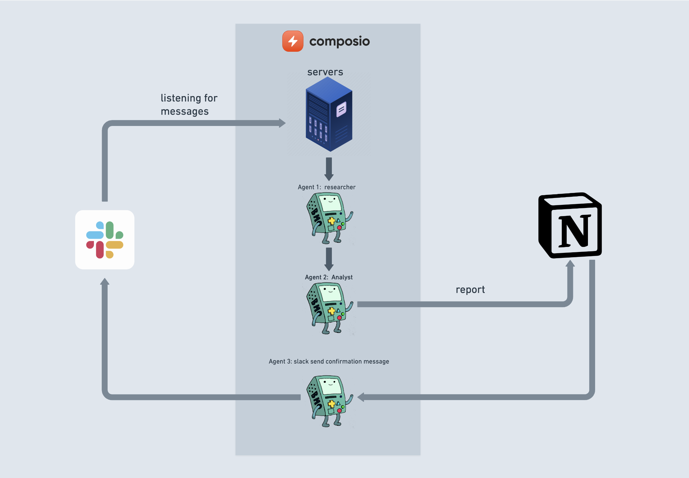

# Building "Useful" Agents with Composio and Lyzr

This is a starter repo for building agents with [Composio](composio.dev) and Lyzr you can use this to update and build your own dynamic agents...

We are doing the following in this repository:

- Using composio to get slack messages
- Using Lyzr to build two agents 1 for researching on the topic and 2nd for writing a detailed analysis on the topic
- And then again using composio to write the detailed report in Notion sending a confirmation message to slack

Here is a diagram to better explain to you how it works



Below is the basic setup you can do to run the repository

## Setup

1. Add .env file and add your OPENAI_API_KEY

```
cp .env.sample .env && code .env
```

**Note**: There's no need to add `TRIGGER_ID` and `CHANNEL_ID` in the .env file right now, **we'll get to that in the next steps**.

2. Run setup script

```bash
chmod +x setup.sh && ./setup.sh
```

and add your ngrok authentication key

```bash
ngrok config add-authtoken < your auth token >
```

**For the auth management and integrations, let's use Composio**

3. Use Composio CLI

```bash
poetry run composio-cli add notion
poetry run composio-cli add slack
```

Go through the flow to notion, and complete the authorization flow.
this will lead to a web page where you first give access to the notion pages you want permissions to be in and then slack where you can just click on allow

### To setup slack trigger to get messages:

You need to either create a public server or tunnel to setup webhook to get messages from composio.

#### Local setup

4. To tunnel to setup webhook to get messages from composio, you can use ngrok.

```bash
ngrok http http://0.0.0.0:2000
```

5. Add your trigger callback URL - URL of your server where your agent will recieve all the update

```bash
poetry run composio-cli set global-trigger-callback "<ngrok-url>"
```

This will setup the callback url to get messages from composio.

6. Enable slack recieve trigger

```bash
poetry run composio-cli enable-trigger slack_receive_message
```

This will enable the trigger to get messages from slack when a message is sent.

7. Now edit the .env file again, and update `TRIGGER_ID` and `CHANNEL_ID`

you can get the channel id

```bash
code .env
```

Instructions:

- You'll get the `TRIGGER_ID` when you run step (6)
- To get `CHANNEL_ID` go to slack channel settings and you'll see it at the end of about settings

#### Public server setup

Public setup doesn't require ngrok and you can directly set global-trigger-callback to the public url and enable the trigger.

## Running the Project

To kickstart your Lyzr of AI agents and begin task execution, run this from the root folder of your project:

```bash
poetry run python main.py
```

This command initializes the serhant Lyzr, assembling the agents and assigning them tasks as defined in your configuration.

This example, unmodified, will run the create a `report.md` file with the output of a research on LLMs in the root folser

## Writing your agent

You can use this repository as as starting repository to write your other agent systems to perform various other tasks you would need to follow the following things

1.  Add your desired apps to authenticate and use
2.  Change the `main.py` file along with `src/serhant/Lyzr.py` for your newer functions
3.  You may need to change any other envs that you are now using

## Support

For support, questions, or feedback regarding Composio or composio_lyzr

- Visit our [documentation](https://docs.composio.dev)
- Reach out to us through our [GitHub repository](https://github.com/SamparkAI/hermes)
- [Joing our Discord](https://discord.gg/xwT747R7NE)
